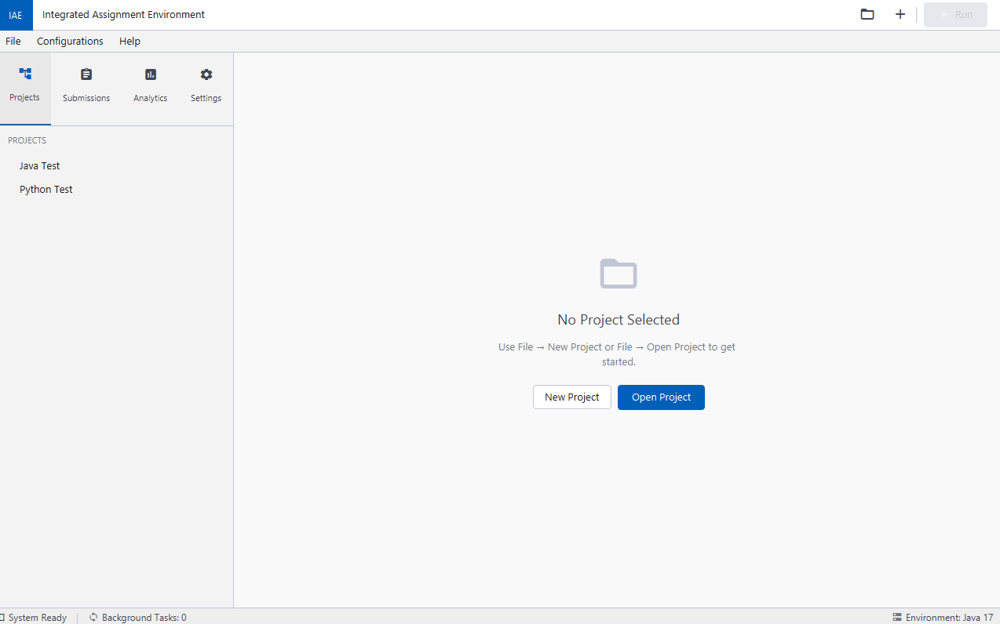
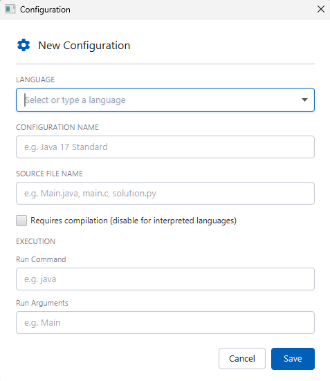
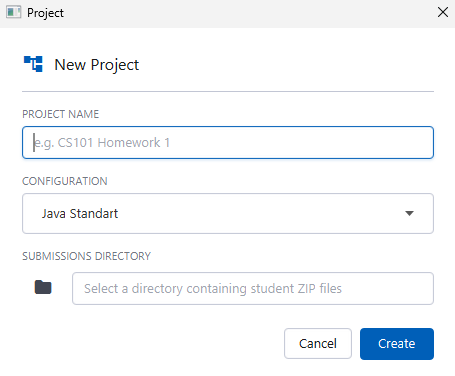
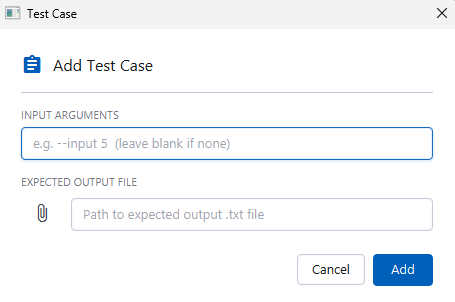
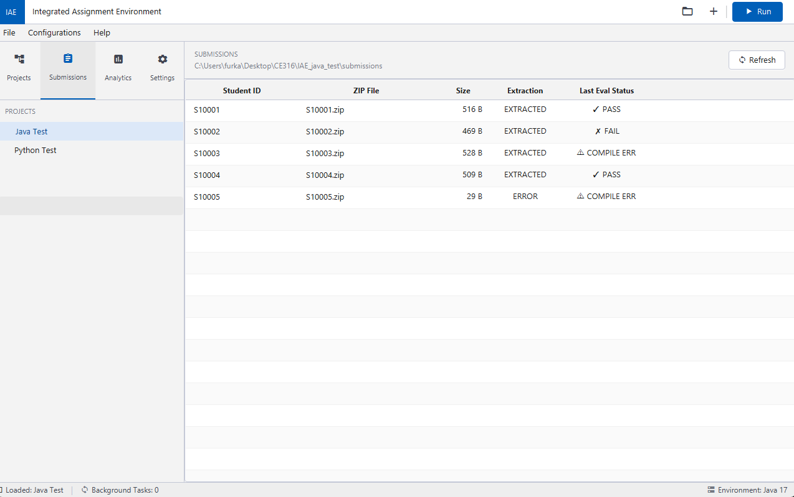
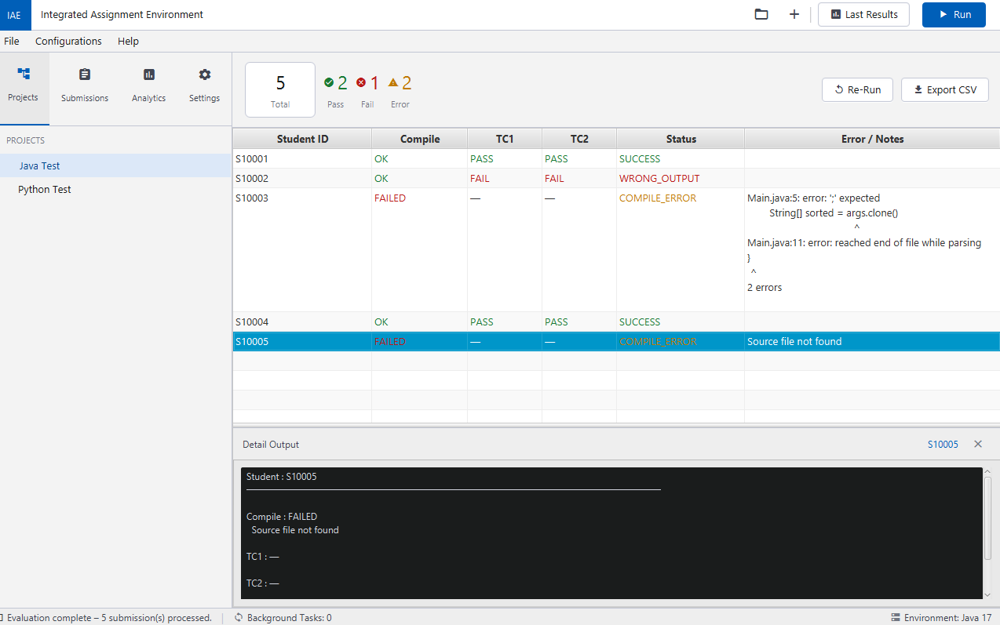
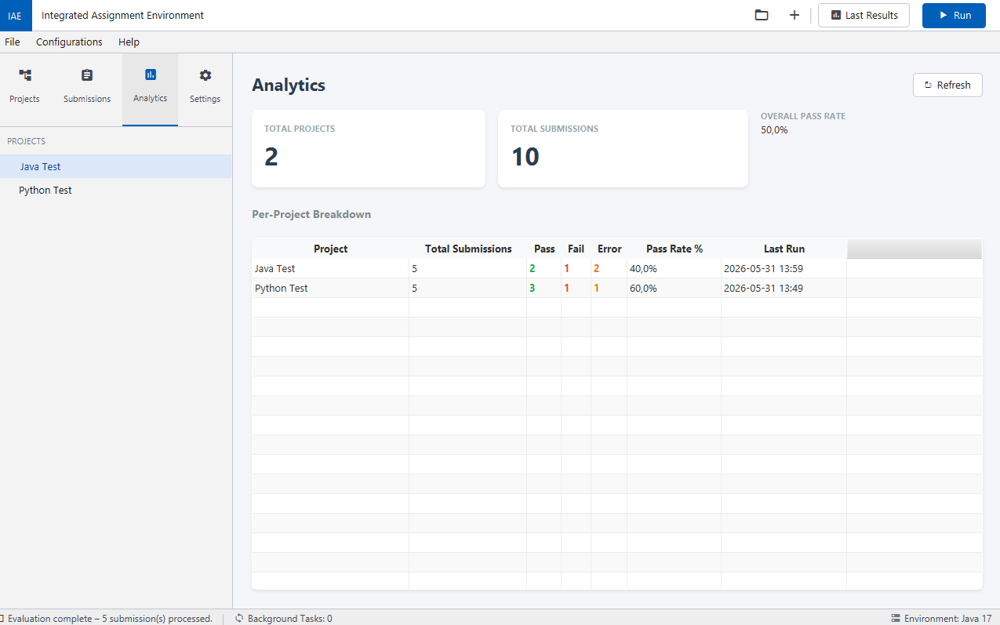
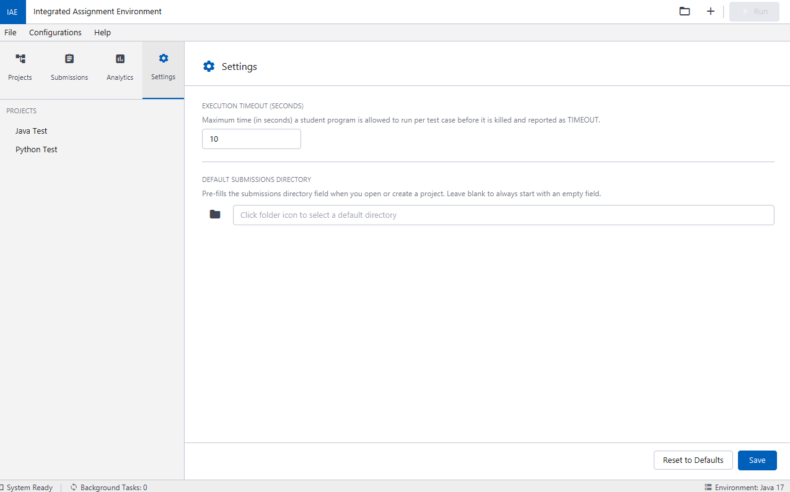

# IAE — Integrated Assignment Environment

A standalone **desktop application** for automated grading of student programming
assignments. The lecturer defines *how* a language is compiled and run (a
**Configuration**), creates a **Project** that points to a folder of student ZIP
submissions, defines **Test Cases** (input arguments + expected output), and hits
**Run**. IAE then compiles/interprets every submission, runs it against each test
case, compares the output, and reports a per-student / per-test-case result —
all stored locally in an SQLite database so projects can be reopened any time.

> Course: **CE 316 — Software Engineering**, Section 2, Team 1.

> See [CE316_DesignDocument_Section2_Team1.pdf](CE316_DesignDocument_Section2_Team1.pdf) for the full design document.

---

## Table of Contents

1. [Screenshots](#screenshots)
2. [Key Features](#key-features)
3. [Technology Stack](#technology-stack)
4. [Prerequisites](#prerequisites)
5. [Build & Run](#build--run)
6. [Core Concepts](#core-concepts)
7. [Usage Guide (step by step)](#usage-guide-step-by-step)
8. [Supported Languages & Presets](#supported-languages--presets)
9. [How Evaluation Works](#how-evaluation-works)
10. [Where Data Is Stored](#where-data-is-stored)
11. [Project Structure](#project-structure)
12. [Troubleshooting](#troubleshooting)

---

## Screenshots


| | |
|---|---|
| **Main window** |  |
| **New / Edit Configuration** |  |
| **New Project** |  |
| **Add Test Case** |  |
| **Submissions view** |  |
| **Results view** |  |
| **Analytics** |  |
| **Settings** |  |


## Key Features

- **Configurations** — create, edit, delete reusable language profiles (compiler/interpreter path, arguments, run command). Built-in presets for 9 languages.
- **Import / Export** — back up or share a configuration as a single `.json` file.
- **Projects** — bundle a configuration, a submissions folder, test cases and results together. Persisted in SQLite and reopenable later.
- **Batch ZIP processing** — point at a folder of student ZIPs; IAE extracts and processes **all of them automatically** (built-in unzip, no external tool needed).
- **Compile / interpret** — handles both compiled (C, C++, Java, Go, Rust, Haskell) and interpreted (Python, JavaScript, Ruby) languages per configuration.
- **Test cases** — provide command-line input arguments and an expected-output file, JUnit style.
- **Output comparison** — built-in comparator (no external `diff` needed) with line-ending / trailing-whitespace normalization and a line-by-line diff.
- **Results** — per-student table: compile status, per-test-case PASS/FAIL/TIMEOUT, overall status, and error notes. Exportable to **CSV**.
- **Analytics** — project-level pass/fail/error counts and pass-rate.
- **Robust** — a compile error, runtime error or timeout in one student's code is reported and the run continues with the next student.
- **Help menu** — built-in user manual + About dialog.
- **Standalone** — no server, no network. Everything is local.

---

## Technology Stack

| Concern | Technology |
|---|---|
| Language | Java 17 |
| GUI | JavaFX 21 (FXML + CSS) |
| Persistence | SQLite (file-based, `iae.db`) via JDBC |
| JSON (import/export) | Gson |
| Build | Maven |


---

## Prerequisites

To **build and run from source** you need:

- **JDK 17** or later (`java --version` should report 17+).
- **Maven 3.8+** (`mvn -version`).
- Internet access on first build (Maven downloads JavaFX and other dependencies).

To **grade submissions**, the relevant compilers/interpreters must be installed and
available on your system `PATH` — e.g. `javac`/`java` for Java, `gcc` for C,
`g++` for C++, `python` for Python, etc. IAE calls these as external programs.

---

## Build & Run

From the project root (`CE316-Project/`):

```bash
# Build a single runnable "fat" JAR (includes all dependencies)
mvn package -q

# Run it
java -jar target/iae.jar
```

Or run directly via the Maven JavaFX plugin during development:

```bash
mvn javafx:run
```

To run the test suite:

```bash
mvn test
```

> **Note on distribution:** the final submission ships with a Windows installer
> (created with jpackage + Inno Setup) that bundles the JavaFX runtime and adds a
> desktop shortcut, so end users do **not** need Maven or JavaFX installed.
> The commands above are for building/running from source.

---

## Core Concepts

| Concept | What it is |
|---|---|
| **Configuration** | A reusable recipe for one language: source file name, whether it needs compilation, the compile command + arguments, and the run command + arguments. Example: *“C Programming Language Configuration”*. |
| **Project** | A single assignment. It references **one** configuration, points to a **submissions directory**, and owns a list of **test cases** and the stored **results**. |
| **Test Case** | One scenario: the **input arguments** passed to the student program plus the **expected output file** its output is compared against. |
| **Submission** | One student's work — either a `.zip` (extracted automatically to `.extracted/<studentID>/`) or an already-extracted folder named after the student ID. |

---

## Usage Guide (step by step)

### 1. Create a Configuration

`Configurations → New Configuration`

1. Enter a **Configuration Name** (e.g. `C Programming`).
2. Pick a **Language** from the dropdown — this auto-fills sensible defaults for
   the source file, compile/run commands and arguments (see the
   [presets table](#supported-languages--presets)).
3. Adjust any field if needed:
   - **Source File Name** — the exact file inside each submission to compile/run (e.g. `main.c`, `Main.java`).
   - **Needs Compilation** — tick for compiled languages; leave unticked for interpreted ones (the compile section hides itself).
   - **Compile Command / Arguments** — e.g. `gcc` + `-o main`.
   - **Run Command / Arguments** — e.g. `./main`, or `java` + `-cp . Main`.
4. **Save**.

> Configurations are global and reusable across many projects.
> Use `Configurations → Edit / Delete Configuration` to manage them.

### 2. (Optional) Import / Export a Configuration

`Configurations → Export Configuration…` saves a selected configuration to a
`.json` file. `Configurations → Import Configuration…` reads such a file back in
as a new configuration — handy for backups or sharing / moving to another machine.

### 3. Create a Project

`File → New Project` (or the **+** button in the toolbar)

1. Enter a **Project Name**.
2. Choose the **Configuration** the project should use (an existing one, or create a new one first).
3. Confirm. The project appears in the left **Projects** tree.

### 4. Select the Submissions Directory

In the project detail pane, click the **folder icon** next to *Submissions
Directory* and select the folder that contains the student submissions.

- Each student's work should be a `.zip` named with their student ID
  (e.g. `S10001.zip`), or an already-extracted folder of the same name.
- ZIPs are extracted automatically into a `.extracted/` subfolder on run.

### 5. Add Test Cases

Click **Add Test Case** in the project detail pane:

- **Input Arguments** — command-line arguments passed to the program (leave blank if none). Example: `5 3`.
- **Expected Output File** — browse to a `.txt`/`.out` file containing the correct output for those arguments.

Add as many test cases as the assignment needs. They appear in the test-cases
table and can be edited or removed from there.

### 6. Run the Evaluation

Press **Run** (toolbar) or **Run Evaluation** (project detail pane).

IAE loops over every submission and, for each one:
1. compiles it (if the configuration requires compilation),
2. runs it once per test case with the given input arguments,
3. compares the program output against the expected output file,
4. records the result.

A progress dialog shows which student is being processed. Errors are captured and
the run continues with the next student.

### 7. View the Results

When the run finishes, the **Results** view opens automatically (and is reachable
later via the **Last Results** button). For each student you see:

- **Compile** — OK / FAILED
- **TC1, TC2, …** — PASS / FAIL / TIMEOUT per test case
- **Status** — overall worst status (SUCCESS, WRONG_OUTPUT, COMPILE_ERROR, RUNTIME_ERROR, TIMEOUT)
- **Error / Notes** — captured error messages

Selecting a row shows the detailed compiler output, program output, stderr and a
line-by-line diff in the side panel. Use **Export** to save the whole table as CSV.

### 8. Analytics

The **Analytics** sidebar tab lists every project with total / pass / fail / error
counts, pass-rate and last-run time.

### 9. Settings

The **Settings** sidebar tab lets you set:

- **Execution Timeout (seconds)** — how long a single program run may take before it is killed and marked TIMEOUT.
- **Default Submissions Directory** — a starting folder for the browse dialogs.

### 10. Open / Save Projects Later

Projects are saved to the local database. Use `File → Open Project` to reopen any
earlier project and review its stored results without re-running. `File → Save
Project`, `Edit Project`, `Close Project` and `Delete Project` are also available
under the **File** menu.

---

## Supported Languages & Presets

Selecting a language in the configuration dialog fills these defaults (every field
remains editable):

| Language | Source file | Needs compile | Compile command | Compile args | Run command | Run args |
|---|---|:---:|---|---|---|---|
| Java | `Main.java` | ✅ | `javac` | _(none)_ | `java` | `-cp . Main` |
| C | `main.c` | ✅ | `gcc` | `-o main` | `./main` | _(none)_ |
| C++ | `main.cpp` | ✅ | `g++` | `-o main` | `./main` | _(none)_ |
| Python | `solution.py` | ❌ | — | — | `python` | `solution.py` |
| JavaScript | `solution.js` | ❌ | — | — | `node` | `solution.js` |
| Ruby | `solution.rb` | ❌ | — | — | `ruby` | `solution.rb` |
| Go | `main.go` | ✅ | `go` | `build -o main` | `./main` | _(none)_ |
| Rust | `main.rs` | ✅ | `rustc` | `-o main` | `./main` | _(none)_ |
| Haskell | `Main.hs` | ✅ | `ghc` | `-o main` | `./main` | _(none)_ |

> For compiled languages the source file name is appended to the compile command
> automatically (e.g. `gcc -o main main.c`). The run argument `-cp . Main` for
> Java means *classpath = current directory, main class = `Main`*.

---

## How Evaluation Works

```
For each submission in the submissions directory:
  ├─ (extract ZIP → .extracted/<studentID>/)
  ├─ Compile phase      (skipped if the config is interpreted)
  │     └─ failure → COMPILE_ERROR, continue with next student
  └─ For each test case:
        ├─ Run program with input arguments  (killed after the timeout → TIMEOUT)
        ├─ Compare stdout with the expected output file
        │     └─ mismatch → WRONG_OUTPUT
        └─ Save per-test-case result
  └─ Save overall result (worst status across all test cases)
```

The output comparison normalizes line endings and trailing whitespace so that
trivial formatting differences don't cause false failures.

---

## Where Data Is Stored

All state lives in a single SQLite file, **`iae.db`**, created in the working
directory on first launch. No server or network is required. Tables:

| Table | Holds |
|---|---|
| `CONFIGURATIONS` | language configurations |
| `PROJECTS` | projects (name, configuration reference, submissions dir, timestamps) |
| `TESTCASES` | test cases per project |
| `RESULTS` | per-student and per-test-case evaluation results |

---

## Project Structure

```
CE316-Project/
├── pom.xml                     # Maven build
├── README.md                   # this file
├── DESIGN.md                   # full design document
└── src/
    ├── main/
    │   ├── java/com/iae/
    │   │   ├── model/          # domain objects (Project, Configuration, TestCase, …)
    │   │   ├── logic/          # engine, compiler, executor, comparator, DB, managers
    │   │   └── ui/             # JavaFX controllers (MainWindow, dialogs, views)
    │   └── resources/com/iae/
    │       ├── fxml/           # UI layouts
    │       ├── css/            # styles
    │       └── fonts/          # bundled fonts
    └── test/java/com/iae/      # JUnit tests
```

---

## Troubleshooting

| Symptom | Likely cause / fix |
|---|---|
| Every student shows **COMPILE_ERROR / "Source file not found"** | The configuration's *Source File Name* must match the actual file inside each submission exactly (e.g. `Main.java`). |
| Compile/run fails with *command not found* | The compiler/interpreter (`javac`, `gcc`, `python`, …) isn't installed or not on the system `PATH`. |
| All test cases show **TIMEOUT** | The program may be waiting for input it isn't getting, or the timeout in **Settings** is too low. |
| Correct-looking output still **fails** | Check the diff panel — there may be a trailing space, extra blank line, or character-encoding difference between the program output and the expected file. |
| App won't start with `java -jar` | Ensure you built with `mvn package` and are using **Java 17+**. |

---

_CE 316 — Section 2, Team 1._
* _Abdulhamid Yıldırım_
* _Ahmet Emir Doğan_
* _Ario Bashiri_
* _Ayşenaz Gelen_
* _Sine Öykü Yaşar_
* _Furkan Pala_


